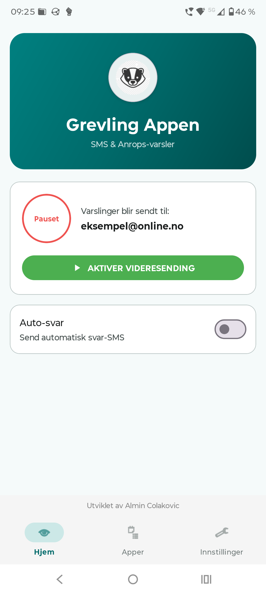
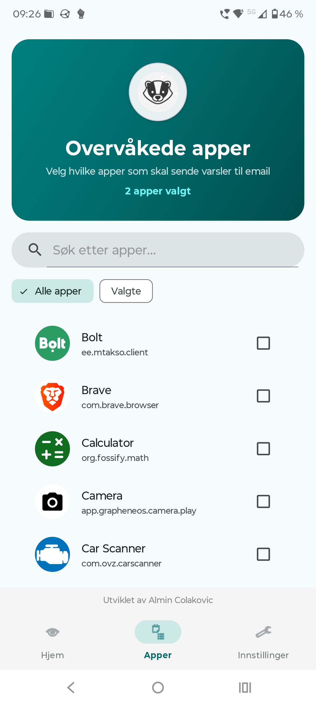
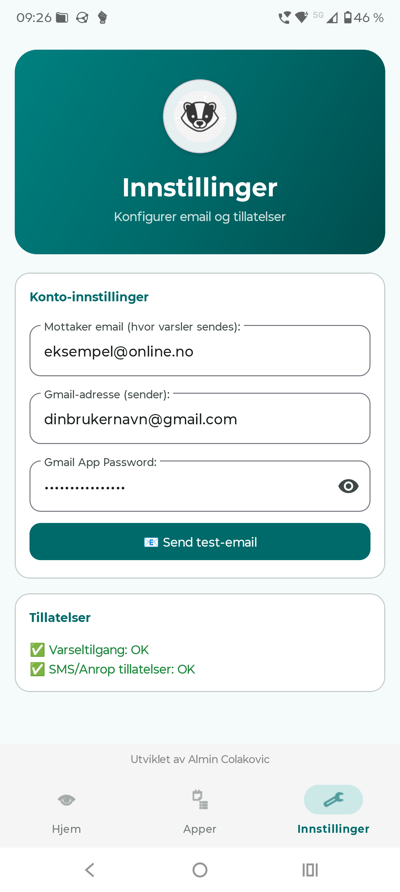

# 🦡 Grevling

**Grevling** er en Android-app som videresender SMS-meldinger, tapte anrop og app-varsler til email via Gmail SMTP. Perfekt for når du ikke har telefonen tilgjengelig, men trenger å holde deg oppdatert.

<p align="center">
  
  
  
</p>

## ✨ Funksjoner

### 📱 Videresending
- **SMS til email** – Alle innkommende SMS sendes til din valgte email-adresse
- **Tapte anrop til email** – Bli varslet når noen ringer og du ikke svarer
- **App-varsler til email** – Velg hvilke apper som skal sende varsler til email
- **Kontaktnavn-oppslag** – Viser kontaktens navn i stedet for bare telefonnummer

### 💬 Auto-svar
- **Automatisk SMS-svar** – Send auto-svar til innkommende SMS
- **Automatisk anrops-svar** – Send SMS til de som ringer og du ikke svarer
- **Unified eller separate meldinger** – Bruk samme melding for alt, eller tilpass per type
- **Låsefunksjon** – Beskytt auto-svar meldingene mot utilsiktet endring

### 🖼️ Widgets
- **Standard widget (3x1)** – Viser status og statistikk
- **Mini widget (1x1)** – Kompakt toggle-knapp for av/på
- **Stats widget (2x2)** – Detaljert statistikk med pause/resume knapp

### 🔒 Sikkerhet
- **Kryptert lagring** – Gmail-legitimasjon lagres med AES256-GCM kryptering
- **TLS 1.2/1.3** – Sikker kommunikasjon med Gmail SMTP
- **HTML-escaping** – Beskyttelse mot injection i emails
- **GDPR-compliant logging** – Ingen sensitiv data i logger

## 📋 Systemkrav

| Krav | Verdi |
|------|-------|
| Android versjon | 10+ (API 29) |
| Target SDK | 34 (Android 14) |
| Arkitektur | Alle (arm64, arm, x86, x86_64) |

## 📦 Installasjon

### Last ned APK
1. Gå til [GitHub Releases](https://github.com/Aliman00/grevling/releases)
2. Last ned siste versjon av `grevling.apk`
3. Aktiver "Ukjente kilder" i Android-innstillinger
4. Installer APK-filen

### Bygg selv
```bash
git clone https://github.com/Aliman00/grevling.git
cd grevling
./gradlew assembleRelease
```

APK-filen finnes i: `app/build/outputs/apk/release/grevling.apk`

## ⚙️ Oppsett

### 1. Gmail App Password

For at appen skal kunne sende email via Gmail trenger du et **App Password**. Dette er et spesielt passord som Google genererer for tredjeparts-apper.

#### Steg 1: Aktiver 2-faktor autentisering (2FA)

**Dette er et krav fra Google for å kunne opprette App Passwords.**

1. Gå til [Google Account Security](https://myaccount.google.com/security)
2. Under "Signing in to Google", velg **2-Step Verification**
3. Følg instruksjonene for å aktivere 2FA

#### Steg 2: Opprett App Password

1. Gå til [App Passwords](https://myaccount.google.com/apppasswords)
2. Velg **Mail** som app
3. Velg **Other (Custom name)** som enhet
4. Skriv inn: `Grevling` eller et annet navn du husker
5. Klikk **Generate**
6. Kopier det **16-tegn passordet** (fjern mellomrom)

#### Steg 3: Konfigurer appen

1. Åpne **Grevling** appen
2. Gå til **Innstillinger**-fanen
3. Fyll ut:
   - **Mottaker email**: Email-adressen hvor du vil motta varsler
   - **Gmail-adresse**: Din `brukernavn@gmail.com`
   - **Gmail App Password**: Det 16-tegn passordet **uten mellomrom**
4. Trykk **📧 Send test-email** for å verifisere

### 2. Tillatelser

Appen trenger følgende tillatelser:

| Tillatelse | Formål |
|------------|--------|
| `RECEIVE_SMS` | Motta innkommende SMS |
| `READ_SMS` | Lese SMS-innhold |
| `SEND_SMS` | Sende automatiske svar |
| `READ_CALL_LOG` | Lese anropslogg for tapte anrop |
| `READ_CONTACTS` | Slå opp kontaktnavn |
| `INTERNET` | Sende email via SMTP |
| `NOTIFICATION_LISTENER` | Lytte til varsler (må aktiveres manuelt) |

### 3. Varseltilgang

For å fange tapte anrop og app-varsler må du gi appen varseltilgang:

1. Gå til **Innstillinger** i appen
2. Trykk **Gi varseltilgang**
3. Aktiver **Grevling** i listen

### 4. Begrensede innstillinger (Android 13+)

Hvis tillatelser blir avvist automatisk på Android 13+:

1. Åpne Android **Innstillinger**
2. Gå til **Apper → Grevling**
3. Trykk på **⋮** (tre prikker) øverst
4. Velg **Tillat begrensede innstillinger**
5. Bekreft med enhetens PIN/mønster

## 🏗️ Arkitektur

```
SMS/Anrop/App-varsel
    ↓
SmsReceiver / NotificationMonitorService
    ↓
EmailSender (bakgrunnstråd)
    ↓
Gmail SMTP (TLS 1.2/1.3)
```

### Hovedkomponenter

| Komponent | Beskrivelse |
|-----------|-------------|
| `MainActivity` | Hoved-aktivitet med BottomNavigation |
| `HomeFragment` | Hjem-skjerm med status og auto-svar innstillinger |
| `AppSelectionFragment` | Velg apper for varsel-overvåking |
| `SettingsFragment` | Gmail-konfigurasjon og tillatelser |
| `SmsReceiver` | BroadcastReceiver for innkommende SMS |
| `NotificationMonitorService` | Lytter til tapte anrop og app-varsler |
| `EmailSender` | Singleton for SMTP email-sending |
| `AutoReplyHelper` | Håndterer auto-svar SMS |
| `PreferencesManager` | Kryptert lagring av credentials |
| `ForwardingStats` | Statistikk over videresendinger |

## 🧪 Testing

```bash
# Kjør alle tester
./gradlew test

# Kjør spesifikk testklasse
./gradlew test --tests "EmailSenderTest"

# Kjør Android lint
./gradlew lint
```

## 📊 Tekniske detaljer

### Avhengigheter

```kotlin
// AndroidX
implementation("androidx.core:core-ktx:1.12.0")
implementation("androidx.appcompat:appcompat:1.6.1")
implementation("androidx.security:security-crypto:1.1.0-alpha06")
implementation("androidx.fragment:fragment-ktx:1.6.2")

// Material Design
implementation("com.google.android.material:material:1.11.0")

// JavaMail for SMTP
implementation("com.sun.mail:android-mail:1.6.7")
implementation("com.sun.mail:android-activation:1.6.7")

// Kotlin Coroutines
implementation("org.jetbrains.kotlinx:kotlinx-coroutines-android:1.7.3")
```

### Sikkerhetsfunksjoner

- **EncryptedSharedPreferences** med AES256-GCM for credential-lagring
- **TLS 1.2/1.3** påkrevd for SMTP-tilkoblinger
- **HTML-escaping** av alt email-innhold
- **Rate-limiting**: Maks 10 emails per minutt
- **Retry-logikk**: 3 forsøk med exponential backoff
- **Thread-safe** operasjoner med synchronized metoder
- **GDPR-compliant** logging (ingen sensitiv data)

## 🐛 Feilsøking

### ❌ Autentisering feilet

**Løsning:**
1. Sjekk at du har aktivert 2FA på Google-kontoen
2. Verifiser at App Password er korrekt (16 tegn, uten mellomrom)
3. Prøv å generere et nytt App Password

### ❌ Connection timeout

**Løsning:**
1. Sjekk internettforbindelsen
2. Verifiser at port 587 ikke er blokkert av brannmur
3. Prøv på et annet nettverk

### ❌ Varsler fanges ikke

**Løsning:**
1. Sjekk at varseltilgang er aktivert for Grevling
2. Deaktiver og reaktiver varseltilgang
3. Start telefonen på nytt

### ❌ Tillatelser avvist automatisk

**Løsning (Android 13+):**
Se "Begrensede innstillinger" under Oppsett-seksjonen ovenfor.

## 📄 Lisens

Personal Use Only License. Se [LICENSE](LICENSE) for detaljer.

**Tillatt:**
- Personlig bruk
- Modifisering for egen bruk

**Ikke tillatt:**
- Kommersiell bruk
- Redistribusjon
- Bruk i andre prosjekter

## 🔐 Sikkerhetspolicy

For sikkerhetsproblemer, se [SECURITY.md](SECURITY.md).

## 📝 Changelog

Se [CHANGELOG.md](CHANGELOG.md) for versjonshistorikk.

## 👤 Forfatter

Utviklet av **Aliman00**

---

<p align="center">
  <strong>🦡 Grevling</strong> – Aldri gå glipp av en viktig SMS eller anrop igjen
</p>

## Lisens

Dette prosjektet er lisensiert under **Personal Use Only License** - se [LICENSE](LICENSE) filen for detaljer.

**Viktig:**
- ✅ Gratis for personlig bruk
- ✅ Kan modifiseres for eget bruk
- ✅ Kan deles med andre (gratis)
- ❌ Kommersiell bruk IKKE tillatt
- ❌ Kan IKKE selges
- ❌ Kan IKKE ha subscription-modeller

For kommersiell bruk, kontakt utvikleren via GitHub Issues.

## Support

For spørsmål eller problemer, opprett en [issue](https://github.com/Aliman00/grevling/issues) i dette repositoriet.
